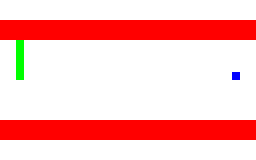

### Objective:

There is a beautiful blue square who is trying its hardest to avoid the stinky green bars.
The green bars are moving towards the agent whose actions are going left or right, or do nothing.

### Folder structure

- Blue.py : contains class that produces the environment and agent. But also handles agent's actions and updates accordingly
- BlueGymEnv.py : contains the Gym environment that will be used to train the agent in the environment
- TrainBlueAgent.py : train the agent
- Blue_eval.py : evalulate the agent and capture the frames to produce a gif

### Blue Square in action
