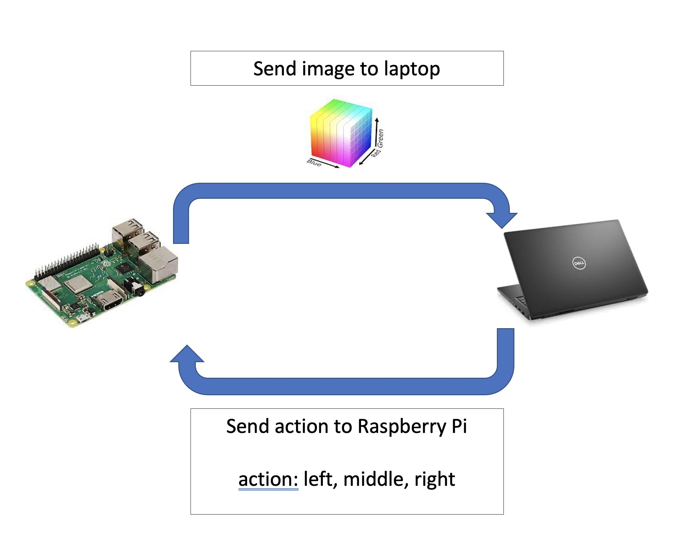

# LegoCar vs Blue Masked Tape

### Objective:
Using CoppeliaSim, the goal is to create and train an agent that can follow a blue line. Once the agent is trained, it will
be transferred to the lego car which will follow the blue masked tape. The actions are limited to steering left or right to keep things simple
as the goal is to understand how to train the agent and apply it to the lego robot.

### How it works
The  model is too big to run directly on the rasbberry pi directly. As a result, the model needs to run a separate computer and send the actions 
to the raspberry pi.

### Lego car's camera view!

### Check out the youtube videos!!

- https://www.youtube.com/watch?v=71SF15HbmlI
  - This particular video shows the lego car successfully navigating the blue masked tape using the trained model built from CoppeliaSim without any modifications  
- https://www.youtube.com/watch?v=nvduLdRa98s
  - A video showing the lego car navigating the original track show in the gif below (the real world)
- https://www.youtube.com/watch?v=ojLoy0G5CaU
  - A video showing the lego car attempting to navigate a track similar to the simulated environment. 
    Note how the lego car fails towards the end. The cause is due to light 
    sensitivity which needs to be addressed moving forward 

### Folder structure

- Car.py : contains class that connects pyrep to coppeliasim
- env.py : contains the Gym environment that will be used to train the agent in the simulated environment
- car_2.ttt : contains the actual file that creates the simulated environment for the agent to ride on. 
  This environment is different to handle more different kinds of turns.
- train.py : trains and evaluates the agent producing model files (model_eval.zip and mode_final.zip)
- play.py : executes the trained agent and captures the frames to produce a gif
- pi.py: file to run on raspberry pi to control the robot based on the model's output
- laptop.py: file to run on a separate computer that can run the model and communicate with the raspberry pi

### Take the new trained model and apply it to the lego car

