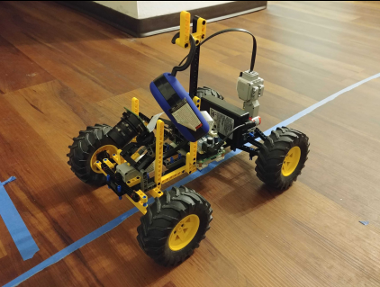
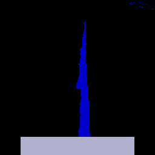

### Objective:

There is an amazing gray car trying to figure out how to follow a blue line that leads somewhere amazing!
This folder takes the Simulation project and attempts to apply it to the lego car
### Folder structure

- Car.py : contains class that connects pyrep to coppeliasim
- env.py : contains the Gym environment that will be used to train the agent in the simulated environment
- car_2.ttt : contains the actual file that creates the simulated environment for the agent to ride on. This environment is different as 
- play.py : executes the trained agent and captures the frames to produce a gif
- train.py : trains and evaluates the agent producing model files (model_eval.zip and mode_final.zip)
- pi.py: file to run on raspberry pi camera
- laptop.py: file to run on laptop to 

### Simulated Car lego in new environment!

### The lego car

### Take the new trained model and apply it to the lego car
- What the raspberry pi camera sees (transformed) and inputs into the model

