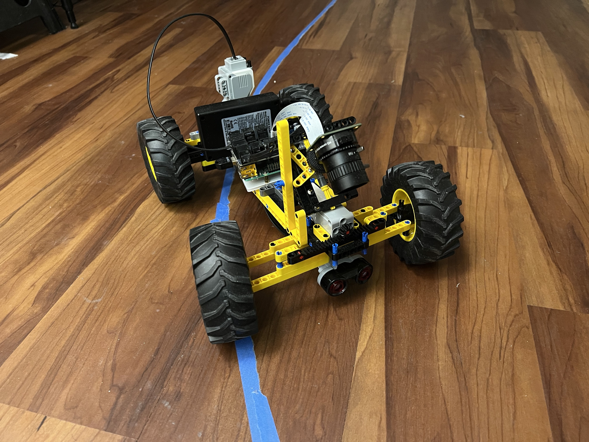
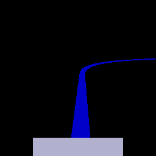
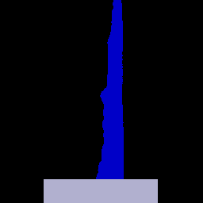

# LegoCar vs Blue Masked Tape

### Objective:
Using CoppeliaSim, the goal is to create and train an agent that can follow a blue line. Once the agent is trained, it will
be transferred to the lego car which will follow the blue masked tape. The actions are limited to steering left or right to keep things simple
as the goal is to understand how to train the agent and apply it to the lego robot.

#### Check out the youtube videos!!
- https://www.youtube.com/watch?v=nvduLdRa98s
  - A video showing the lego car navigating the original track show in the gif below (the real world)
- https://www.youtube.com/watch?v=ojLoy0G5CaU
  - A video showing the lego car attempting to navigate a track similar to the simulated environment. 
    Note how the lego car fails towards the end. The cause is due to light 
    sensitivity which needs to be addressed moving forward 

### Side note:

When training a model on a simulated environment, you want to mimic the real world as much as possible. The simulated car in `car_2.ttt`
is not similar to the lego car however the actions are close enough to the point that the agent can be transferable to the actual lego car.
This is just an experiment for me to understand the basic components needed to train a simulated model and then applying it to a real robot. 

What makes this model different compared to the Simulation folder is that the input is transformed into a simplified image.
This allows the model to be used in the real world by easily transforming the image into a similar format. As a result,
the model can easily be transferred to the lego car without any further complicated modifications.

Finally, one can easily criticize how the objective was completed:
  - Isolating the blue line with a black background was done through simple filtering using 
RGB values
  - Structure of the code is not modular
  - There is an additional transformation process required to for the model to run in real environment

These are legitimate concerns that will be addressed as the project matures.

### Folder structure

- Car.py : contains class that connects pyrep to coppeliasim
- env.py : contains the Gym environment that will be used to train the agent in the simulated environment
- car_2.ttt : contains the actual file that creates the simulated environment for the agent to ride on. 
  This environment is different to handle more different kinds of turns.
- train.py : trains and evaluates the agent producing model files (model_eval.zip and mode_final.zip)
- play.py : executes the trained agent and captures the frames to produce a gif
- pi.py: file to run on raspberry pi to control the robot based on the model's output
- laptop.py: file to run on a separate computer that can run the model and communicate with the raspberry pi

### Simulated Car lego in new environment!

### Take the new trained model and apply it to the lego car

